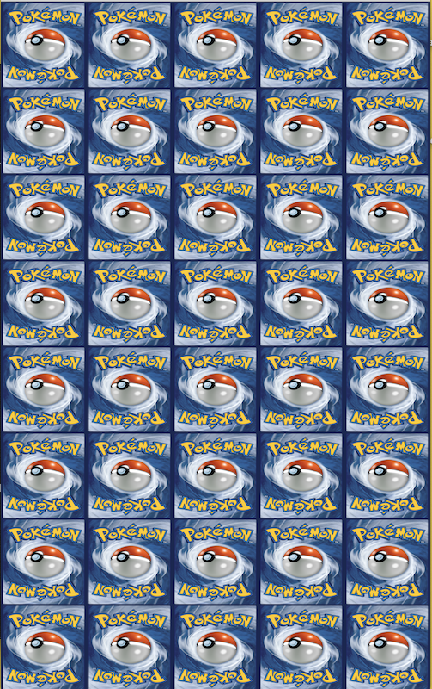
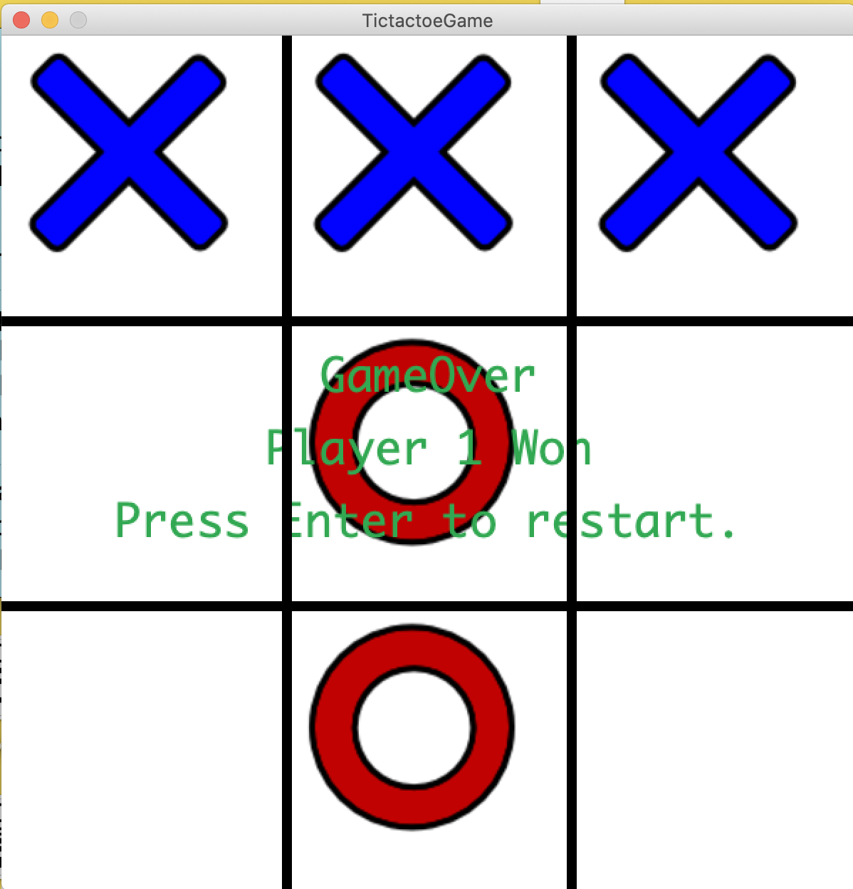
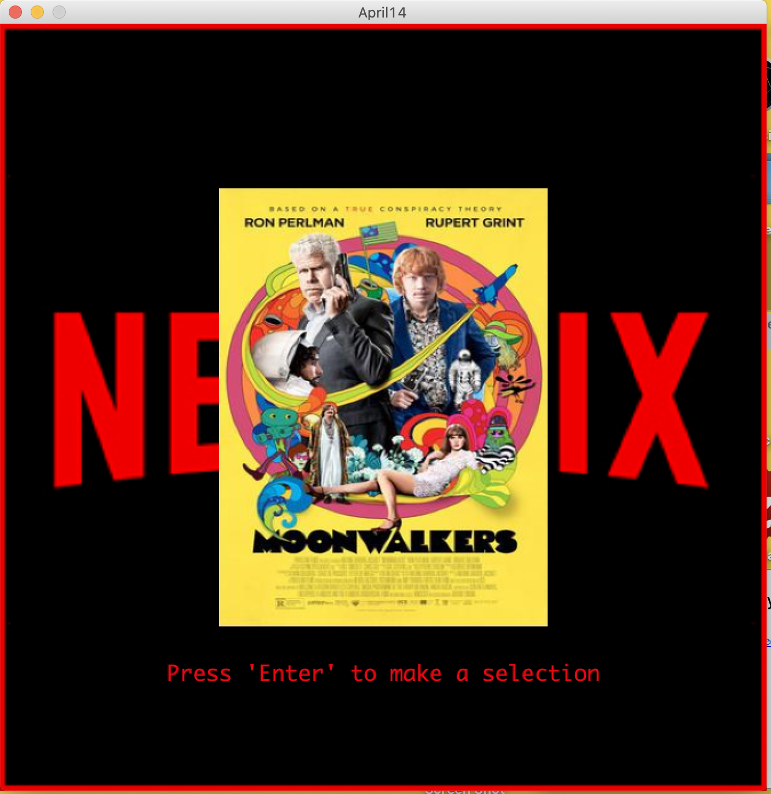
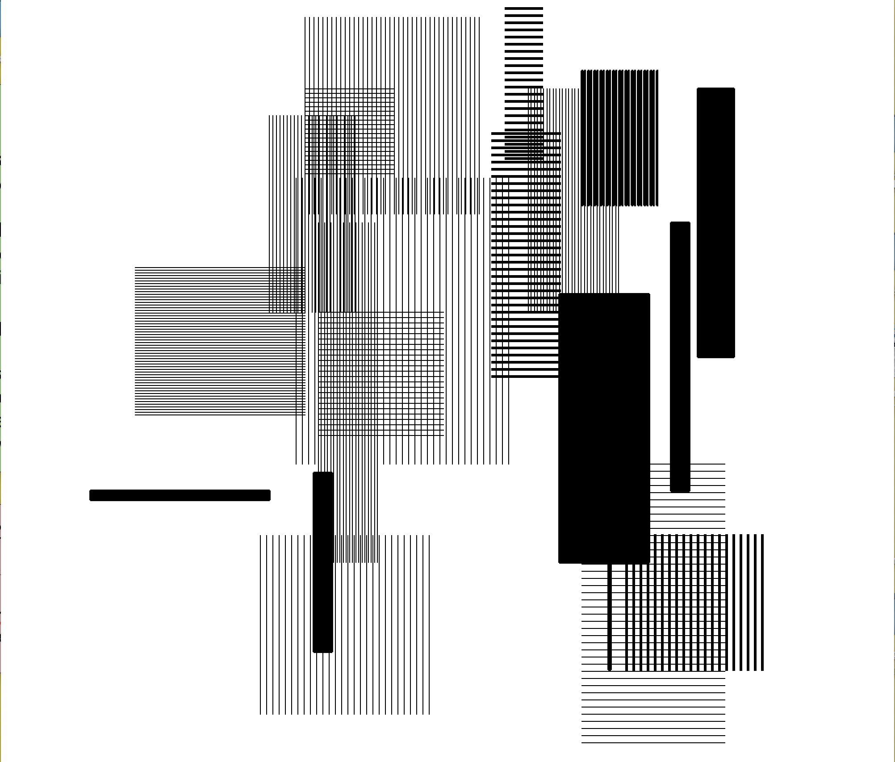
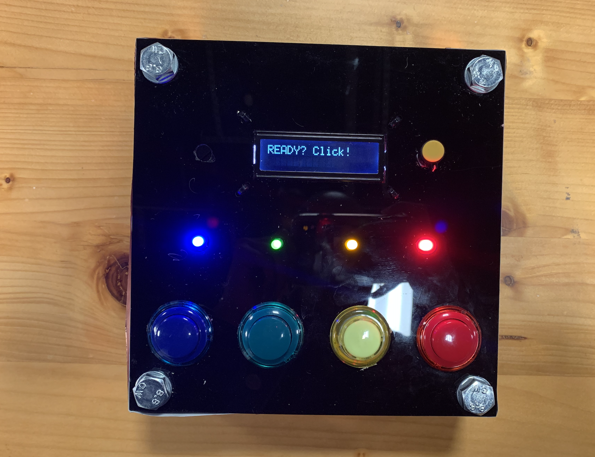

# Portfolio-of-Projects
Portfolio of projects I've worked on in the past.

The projects I am currently hosting are:

**Matching Game:**

Memory game, match the cards to win. Find the game here.

**Tic-Tac-Toe:**

A classic tic-tac-toe game for 2 players. Find the game here.

**Netflix Reccomendation Generator:**

A generator that reccomends random netflix movies sourcing content from a CSD file. Find the program here. 

**Graphic Recreation:**

A recreation of an old graphic design using processing. Find the piece here.

**"Simon Says":**

Simon says button game, follow the pattern to advance to different levels. Find the game here. 

**Websites:**

My first few websites that I developed in my Communications Lab class. Find them here.
